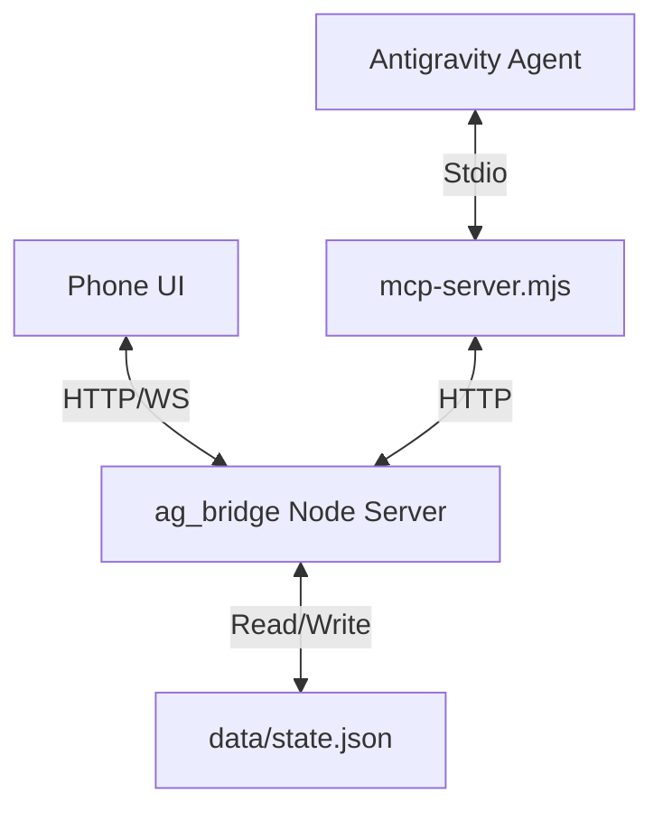

# AG Memory Seed — ag_bridge (LAN-only Companion App)

> **Purpose:** This is your persistent operating context for building and evolving **ag_bridge** — a local “phone app” (PWA-ish web UI) + approval-gated control plane + **Comms Bridge** for supervising agent work on the same LAN.  
> **Tone:** Build it like it’s going to be used at 2:57 AM by someone tired and impatient (Mario), and the agent is feeling “creative.”  
> **Prime directive:** **No money. No cloud. No domains. LAN-only.**

---

## 0) What we are building (Evolution)
**ag_bridge** is a **local daemon** running on the developer laptop.

### v0.2 (Current Prod)
- **Mobile-friendly dashboard** reachable from phone on **same Wi-Fi**.
- **Pairing** (6-digit code) -> Token auth.
- **Approval Queue**: Pending/Approved/Denied.
- **Persistence**: `data/state.json` (survives restarts).
- **Strict Mode**: `policy.json` (allow/deny regex).
- **Request API**: `POST /approvals/request` for agents.
- **PWA**: Installable app.

### v0.3 (Next: Comms Pivot)
**Objective**: Enable Chat between Phone User <-> Antigravity Agent.
- **Message Bus**: `POST /messages/send`, `GET /messages/inbox`.
- **MCP Server**: `mcp-server.mjs` exposes tools for Agent interaction.
- **Agent Heartbeat**: Agent reports status ("working", "idle", "error") to bridge.
- **@file Workflow**: Agent can read repo files referenced in chat (e.g. "read @val_replies.log").

---

## 1) Non-negotiables (Mario’s rules + safety)

### 1.1 Safety and operational discipline
- **Do NOT** run destructive commands: no `rm -rf`, no format/disk tools.
- **Do NOT** change permissions (`chmod`, `chown`).
- **Do NOT** expose this publicly to the internet.
- **Strict Mode**: Enforced by default via `policy.json`.

### 1.2 Scope control
- Stack: Node.js + Express + ws + @modelcontextprotocol/sdk.
- No database (use `data/state.json`).
- Minimal deps.

### 1.3 UX expectations
- **Phone-first**: Large buttons, readable text.
- **Chat UI**: Threaded view, quick actions (STOP, CONTINUE, STATUS).

---

## 2) Architecture (v0.3)



### 2.1 Message Flow
- **Phone**: Sends message -> Bridge persists -> Broadcasts WS -> Agent pulls via MCP.
- **Agent**: Polls inbox via MCP -> Bridge -> Phone receives via WS.
- **@file**: Phone says "@file" -> Agent parses -> Calls `repo_read_file` tool -> MCP reads file securely.

---

## 3) API Contract (v0.3 Additions)

### 3.1 Messages
- `POST /messages/send`
  - Body: `{ to: "agent"|"user", channel: "work"|"qa", text: string }`
  - Returns: `{ ok: true, message: { id, ... } }`
- `GET /messages/inbox`
  - Query: `?to=agent&status=new`
  - Returns: `{ messages: [...] }`
- `POST /messages/:id/ack`
  - Body: `{ status: "read"|"done" }`

### 3.2 Agent State
- `POST /agent/heartbeat`
  - Body: `{ state: "idle"|"working", task: string, note: string }`
- `GET /agent/status`
- `POST /checkpoint`
  - Body: `{ n, N, risk, changedFiles, verifyCmds, next }`

### 3.3 Persistence
- `data/state.json` tracks: `approvals`, `messages`, `agent` state, `checkpoints`.
- Atomic writes with debounce.

---

## 4) MCP Contract (mcp-server.mjs)
Standard Stdio server exposing tools:
1. `messages_inbox(to, status)`
2. `messages_send(to, channel, text)`
3. `messages_ack(id, status)`
4. `agent_heartbeat(state, task, note)`
5. `checkpoint_post(...)`
6. `repo_read_file(path, mode="tail", maxBytes)`: **Critical**. Reads file content for "@file" workflow.
7. `repo_list(pattern)`

---

## 5) Repo Layout
```
ag-bridge/
  package.json
  server.mjs          # Express + WS + State Logic
  mcp-server.mjs      # MCP Stdio Server
  policy.json         # Strict Mode Rules
  request-approval.mjs # CLI Helper
  data/               # Persistent State
  public/
    index.html        # PWA + Chat + Approvals
    manifest.json
    sw.js
```

---

## 6) Development Workflow
1. **Dev Branch**: All work on `dev`.
2. **PR**: Merge to `main` via PR.
3. **Squash & Merge**: Keep history clean.
4. **Tag**: Tag releases on `main` (e.g. `v0.2`, `v0.3`).

---

## 7) Verification (v0.3)
1. **Chat**: Send "Hello" from Phone -> Agent sees it (mocked/real).
2. **Agent Reply**: Agent sends reply -> Phone displays it.
3. **@file**: Agent reads file content via MCP when prompted.
4. **Heartbeat**: Dashboard shows Agent status (Idle/Working).
