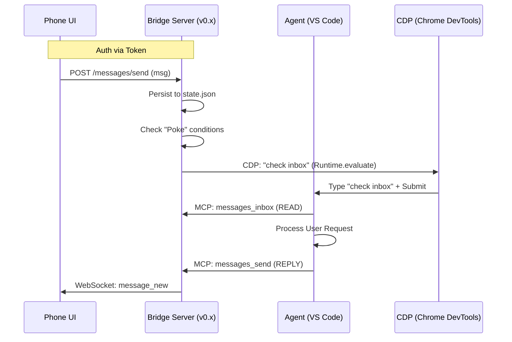

# AG Bridge Architecture

This document outlines the architecture of AG Bridge, a lightweight relay server connecting a Mobile UI to the Antigravity Agent running in VS Code.

## High-Level Flow

## Components

### 1. Bridge Server (`server.mjs`)
- **Role**: The central coordinator.
- **Stack**: Node.js + Express (HTTP) + `ws` (WebSocket) + `ws` (CDP Client).
- **Persistence**: `data/state.json` (Messages, Approvals, Agent Status, Tokens).
- **Security**: LAN-only, Token-based Auth (Headers: `x-ag-token`).

### 2. "The Poke" (`scripts/poke.mjs`)
- **Role**: Remote wake-up mechanism for the Agent.
- **Mechanism**: Connects to VS Code via Chrome DevTools Protocol (CDP) on port 9000.
- **Logic**:
  - Finds the "Launchpad" or "Workbench" target.
  - Iterates execution contexts (iframes) to find the Chat UI.
  - Checks if Agent is "busy" (Cancel button visible).
  - If Idle: Injects "check inbox" and simulates submit.
  - If Busy: Server schedules retries (backoff/loop).

### 3. MCP Server (`mcp-server.mjs`)
- **Role**: The interface for the Agent to interact with the outside world.
- **Transport**: Stdio (spawned by VS Code).
- **Tools**:
  - `messages_inbox`: Read pending messages.
  - `messages_send`: Reply to user.
  - `agent_heartbeat`: Update internal status/task.

### 4. Phone UI (`public/*`)
- **Role**: Mobile-first interface for the user.
- **Features**: Chat, Approvals Dashboard, Status Monitor.
- **Connectivity**: Local Wi-Fi (access via IP:Port).

## Security Model (v0.x)
- **Scope**: LAN Only (Home Network).
- **Trust**: Assumes secure local network.
- **Auth**: Pairing Code (initial) -> Persistent Token.
- **Policy**: `policy.json` validates sensitive commands (strict mode).

## Observability
- **Logs**: `.logs/ag-bridge-YYYY-MM-DD.log`
- **Status Endpoint**: `GET /status` (returns CDP, server, and agent health).
